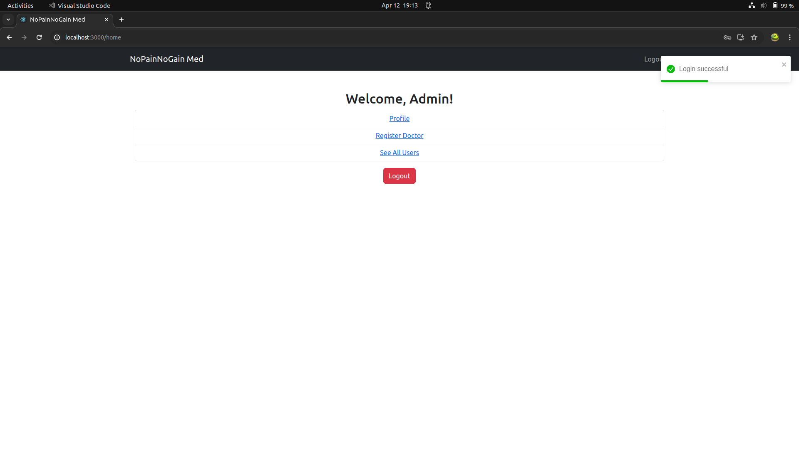
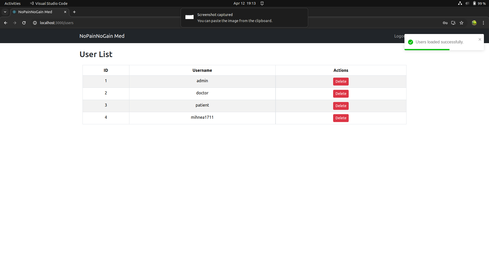
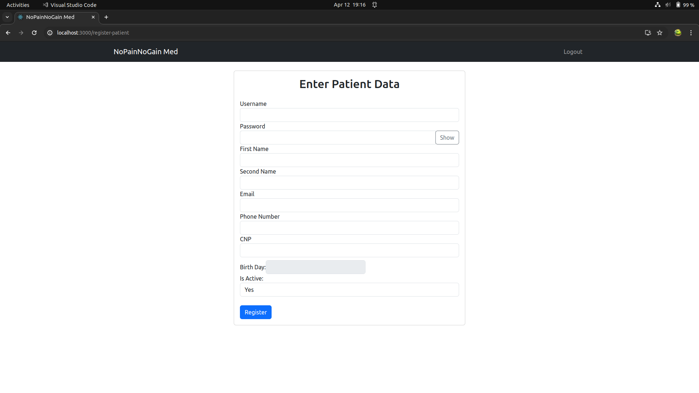
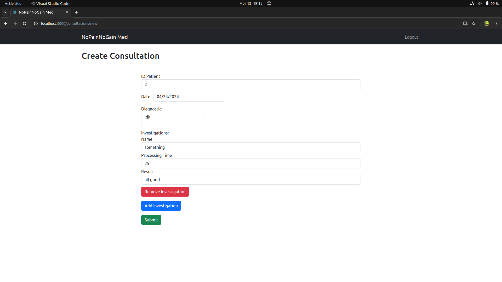

# NoPainNoGain Med
## Overview

NoPainNoGain Med is a medical-oriented application designed for administrators, doctors, and patients within a medical institute. The application facilitates various roles with specific responsibilities, such as managing the application, handling patients, appointments, consultations, and more.
## Frontend

The frontend is implemented in React with Bootstrap, providing a simple and intuitive user interface. While the frontend's primary goal is demonstrative, it ensures a seamless flow of actions. The communication between the frontend and the backend is managed by a Gateway service, acting as a reverse proxy with additional functionalities like request validation, CORS setup, JWT authorization, and data preprocessing.
## Backend Architecture

The backend is implemented in Golang, following RESTful microservice architecture standards. The services include:
### Gateway Service

    Acts as a reverse proxy.
    Validates requests, implements CORS for frontend communication.
    JWT authorization and validation.
    Data preprocessing and forwarding to the desired microservice.
    Logging middleware and a blacklist for invalid JWTs.

### IDM Microservice (Identity Management) - gRPC

    Manages user-specific data (user_uuid, username, password, and role).
    Utilizes MySQL for the User and Role tables, and Redis for JWT blacklisting.
    Implements request validation, Redis request limiter, and data storage for blacklisted JWTs.
    Communicates using gRPC for enhanced efficiency.

### Patients, Doctors, and Appointments Microservices - REST

    Share a common database for storing relevant information.
    Redis limiters and proper validations on requests and fields.
    Follow RESTful principles for communication.

### Consultations Microservice - REST

    Manages consultation-related data using MongoDB.
    Implements Redis limiter and proper validation on fields.
    Follow RESTful principles for communication.

### Rabbit Microservice (Bonus)

    Listens for user delete actions via RabbitMQ.
    Two-phase commit for user deletion.
    Validates the availability and health of IDM, Patients, and Doctors microservices.
    Restores data in case of a rollback.

## Deployment

The entire backend is containerized with Docker and can be easily deployed using the provided start script. Sensitive data, tokens, and database parameters are securely stored in .env files. Databases are created at deploy time using scripts included in the respective microservice Dockerfiles.
Getting Started

    Clone the repository.
    Run the start script to deploy the backend services.
    Access the frontend to interact with the application.

 

 

